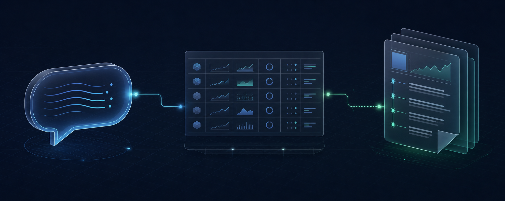
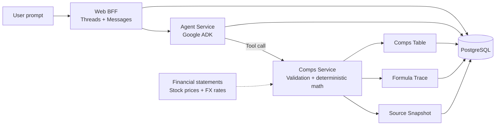

<p align="center">
  
</p>

<h1 align="center">Talk to Your Stock</h1>

<p align="center">
  <strong>Fundamental analysis with deterministic, auditable trading comps.</strong>
</p>

<p align="center">
  
  
  
  
</p>

Talk to Your Stock turns natural-language company comparison requests into structured trading comps.

The model interprets intent. Python calculates the numbers. Each successful Run links the answer to a Comps Table, formula-level Trace, and immutable Source Snapshot.

> [!NOTE]
> This is a local, pre-production MVP. The architecture and controlled-data workflow are implemented; real provider and FX inputs are the current milestone.

## Why I am building it

Finance assistants are good at explaining ideas, but free-form model output is a poor place to perform valuation math.

Talk to Your Stock separates those responsibilities: the Agent handles conversation and Tool selection, while the Comps Service owns deterministic calculations and evidence.

The design goal is simple: keep model reasoning flexible without asking anyone to trust model-generated numbers.

## From question to evidence

> **User:** Compare Apple with Microsoft and Nvidia.

The contract-tested workflow is:

1. Persist the User Message before invoking the Agent.
2. Let Google ADK decide whether to answer directly or call the Comps Tool.
3. Validate the Target and Peer Tickers before creating a Run.
4. Calculate market value, enterprise value, EV multiples, and P/E in deterministic Python.
5. Persist the Comps Table, formula Trace, and Source Snapshot together.
6. Link the assistant Message back to the completed Run.

The Agent never invents a Comps Table. A deterministic table exists only after the Tool succeeds.

## What works today

| Capability | Current implementation |
| --- | --- |
| Chat state | Persisted Users, Threads, Messages, and ordered Agent turns |
| Agent routing | Google ADK conversational responses, Tool selection, and one validation retry |
| Tool safety | One successful Comps Run per invocation, including parallel-call protection |
| Comps engine | Market cap, net debt, enterprise value, EV/Revenue, EV/EBIT, EV/EBITDA, and P/E |
| Auditability | Formula inputs, source references, immutable Source Snapshots, and Run linkage |
| Service contracts | FastAPI boundaries backed by Pydantic schemas and OpenAPI |
| Persistence | PostgreSQL schemas managed through Alembic migrations |
| Operational truth | Health and dependency-aware readiness checks that fail closed |
| Local environment | Docker Compose for PostgreSQL, migrations, Web BFF, Agent Service, and Comps Service |

## Evolving architecture

This diagram captures the backend shape implemented today. It is a working design, not a claim that the service boundaries or data flow are final.

As the product moves from controlled data to real providers and a web experience, the architecture will evolve with what those milestones teach.



Current responsibilities:

- **Web BFF** currently owns the user-facing API, local identity, Threads, and Messages.
- **Agent Service** currently owns conversation, intent, Tool routing, and ADK session history.
- **Comps Service** currently owns validation, calculations, Runs, tables, traces, and evidence.
- **Shared** currently contains small cross-service contracts rather than domain business logic.

The [architecture decisions](docs/adr/) record the reasoning behind the current shape. They will be revised when new product evidence changes the design.

## Engineering decisions I care about

### LLM for intent, code for math

The Agent converts natural language into a validated Tool request. It cannot override the Tool result or present its own arithmetic as a deterministic Comps Table.

### Audit data is product data

Each calculated value can point back to its formula, inputs, source field, and as-of time. Raw provider evidence and normalized inputs are captured in a Run-specific Source Snapshot.

### Readiness must tell the truth

Health means a process is alive. Readiness verifies configuration, migrations, dependencies, and required capabilities. Missing production behavior produces a clear failure rather than a green check.

## Technology

| Layer | Technology |
| --- | --- |
| APIs and contracts | Python 3.12, FastAPI, Pydantic, OpenAPI |
| Agent orchestration | Google Agent Development Kit |
| Persistence | PostgreSQL, SQLAlchemy, Alembic |
| Service communication | HTTP, service credentials, shared schemas |
| Local environment | Docker Compose |
| Testing | `unittest`, FastAPI `TestClient`, real HTTP boundary tests |

## Run locally

### Docker Compose

Create the local environment file:

```bash
cp dev/.env.example dev/.env
```

Add the API keys needed for the paths you want to exercise, then start the backend stack:

```bash
docker compose -f dev/docker-compose.yml up --build -d
```

Check each service:

```bash
curl http://localhost:8000/v1/health
curl http://localhost:8001/v1/health
curl http://localhost:8002/v1/health
```

Readiness currently returns `503` for the canonical Comps path until real provider and FX Run inputs are connected. This is intentional.

See the [development guide](dev/README.md) for environment variables, readiness behavior, and manual Python setup.

### Tests

Install the Python dependencies, then run both suites:

```bash
PYTHONPATH=shared:web-bff:agent-service:comps-service \
  python -m unittest discover -s tests -p 'test_*.py'

PYTHONPATH=shared:comps-service \
  python -m unittest discover -s comps-service/tests -p 'test_*.py'
```

Live provider tests are opt-in so the default suite remains deterministic.

## Repository guide

```text
web-bff/          User-facing API, local identity, Threads, and Messages
agent-service/    Google ADK orchestration and the Fundamental Analysis Agent
comps-service/    Deterministic calculations, Runs, tables, traces, and snapshots
shared/           Cross-service schemas, enums, IDs, and readiness contracts
api/              OpenAPI source of truth
dev/              Docker Compose and local environment guidance
docs/adr/         Binding architecture decisions
docs/database/    Migration design and operating guidance
```

### Technical sources of truth

- [OpenAPI contract](api/openapi.yaml)
- [High-level architecture](docs/adr/ADR-001-mvp-high-level-architecture.md)
- [Fundamental data caching](docs/adr/ADR-002-fundamental-data-caching-strategy.md)
- [Agent architecture](docs/adr/ADR-003-agent-architecture.md)
- [Agent chat persistence](agent-service/README.md)
- [Database migration design](docs/database/README.md)

---

This project is for software engineering and financial-analysis research. It does not provide investment advice.
