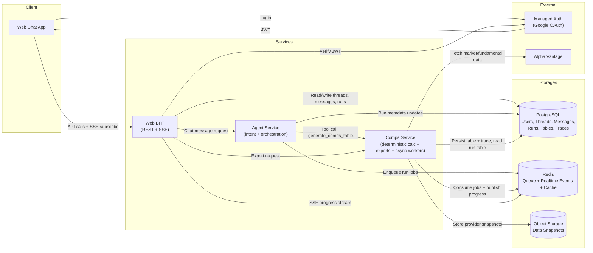

# ADR-001: MVP High-Level Service Architecture

## Context & Background

TalkToYourStock is in system-design phase with MVP scope focused on chat-first comps generation.

What must be true:
* Fast product iteration for a single web client.
* Deterministic and auditable comps outputs.
* Clear support for conversational responses where some messages do not trigger table jobs.

## Decision

### Architecture / Flow



Notes:

* `Comps Service` owns the domain capability; async workers are its execution mode.
* MVP CSV/XLSX exports are owned by `Comps Service` because they are direct representations of comps table results.
* Implementation should keep exports in an internal `exports/` module so the boundary can become a standalone service later if exports become async, template-heavy, multi-artifact, or independently scalable.

### Authentication Model (MVP)

* Login method: Google-only initially.
* Use a managed auth provider for OAuth and token issuance.
* Web BFF verifies JWT on every user-facing request and enforces tenant boundaries.
* PostgreSQL stores app user records and provider user-id mapping.
* No separate Auth Service in MVP.

### Repository Layout

Implementation will use one Git repository with separate top-level service folders.

| Thing | Recommendation |
| --- | --- |
| Separate deployable service folders | Yes |
| Separate Git repositories | No |
| Git submodules/subrepos | No |
| One repo with clean service boundaries | Yes |

Initial layout:

```text
web-bff/
agent-service/
comps-service/
shared/
infra/
  docker-compose.yml
```

`comps-service` owns an internal `exports/` module for MVP CSV/XLSX exports.

`shared/` is reserved for small cross-service contracts and utilities, such as common schemas, error shapes, IDs, and enums. Business logic must stay inside the owning service.

### Decision Summary

> We decided to use a **Web BFF + Agent Service + Comps Service** architecture, backed by **PostgreSQL, Redis, and Object Storage**, in order to deliver deterministic chat-driven comps with auditability, downloadable outputs, and realtime UX, within the constraints of MVP speed and low operational overhead.

### Rationale

* Decision drivers: maintainability, deterministic financial correctness, UX responsiveness, extensibility.
* Key assumptions:
  * One primary client (web chat) in MVP.
  * Authentication is Google-only via managed auth provider.
  * Runs are created only for table-generation comps requests.
  * Non-comps conversational replies must not create runs.
* Non-goals:
  * Multi-provider abstraction in MVP.
  * Dedicated standalone Auth Service in MVP.
  * Multi-client API optimization in MVP.
  * Fully distributed microservice platform from day one.

---

## Consequences

### Positive

* Clean service boundaries aligned with product responsibilities.
* Run model supports async execution, progress tracking, and auditable outputs.
* BFF keeps client integration simple and allows fast UX iteration.
* Storage split (PG/Redis/Object Storage) matches data access patterns and reliability needs.
* Keeping exports inside Comps Service avoids a thin service boundary while exports are simple CSV/XLSX representations of run tables.
* The internal `exports/` module preserves a clean future extraction path.

### Negative / Trade-offs

* More moving parts than a single-process monolith.
* Requires queue/event operational practices earlier (Redis + workers).
* BFF-centric shape may require refactor when multiple clients with different needs appear.
* Export work is coupled to Comps Service until exports become rich enough to justify extraction.


## Considered Alternatives

* **Single monolith service for all concerns**
  Rejected because it blurs domain boundaries and makes async run handling, streaming, and export growth harder.

* **BFF directly calling provider and calculating comps (no agent/comps split)**
  Rejected because orchestration logic and deterministic calc logic become tightly coupled in one layer.

* **Separate Export Service in MVP**
  Rejected because MVP exports are simple CSV/XLSX representations of comps results. A separate service is deferred until exports become async, template-heavy, multi-artifact, or independently scalable.

* **Full microservice decomposition from day one**
  Rejected because operational overhead is high for MVP and slows product learning.
