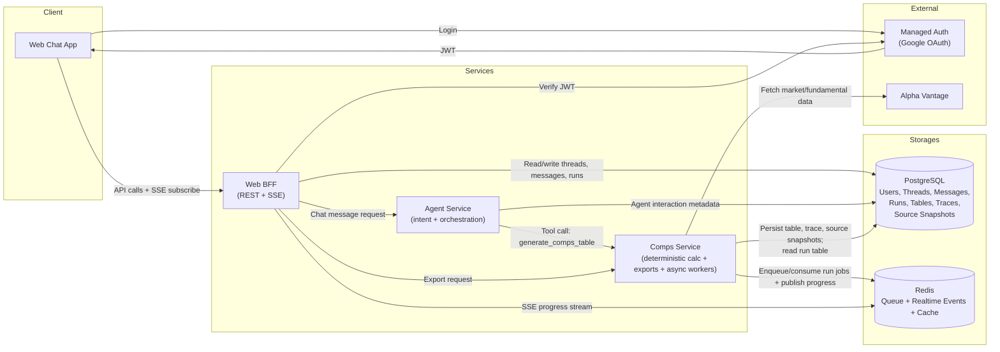

# ADR-001: MVP High-Level Service Architecture

## Context & Background

TalkToYourStock is in system-design phase with MVP scope focused on chat-first comps generation.

What must be true:
* Fast product iteration for a single web client.
* Deterministic and auditable comps outputs.
* Clear support for conversational responses where some messages do not trigger table jobs.
* MVP source snapshots are expected to be small enough to store alongside run records without object-storage lifecycle complexity.

## Decision

### Architecture / Flow



Notes:

* `Comps Service` owns the domain capability and its execution mode. The Agent calls the `generate_comps_table` tool contract and does not enqueue jobs or depend on worker mechanics.
* MVP CSV/XLSX exports are owned by `Comps Service` because they are direct representations of comps table results.
* Implementation should keep exports in an internal `exports/` module so the boundary can become a standalone service later if exports become async, template-heavy, multi-artifact, or independently scalable.
* MVP source snapshots are stored in PostgreSQL JSONB as separate run-bound records, not in object storage. They remain conceptually and schematically separate from the reusable Fundamental Cache.
* Object Storage is deferred until source snapshots become large, file-like, numerous enough to require lifecycle policies, or otherwise artifact-like.

### Authentication Model (MVP)

* Login method: Google-only initially.
* Use a managed auth provider for OAuth and token issuance.
* Web BFF verifies JWT on every user-facing request and enforces tenant boundaries.
* PostgreSQL stores app user records and provider user-id mapping.
* No separate Auth Service in MVP.
* Local development may use an explicit environment-controlled dev-auth identity for smoke tests and backend integration. Dev auth must not be a production fallback: production mode requires managed auth/JWT verification and readiness must fail clearly when required auth configuration is missing.

### Repository Layout

Implementation will use one Git repository with separate top-level service folders.

| Thing | Recommendation |
| --- | --- |
| Separate deployable service folders | Yes |
| Separate Git repositories | No |
| Git submodules/subrepos | No |
| One repo with clean service boundaries | Yes |

Initial layout:

```text
web-bff/
agent-service/
comps-service/
shared/
dev/
  docker-compose.yml
```

`dev/` is the repository folder for local development setup, such as Docker
Compose and local service wiring. Cloud deployment configuration can be added
under a separate folder later if deployment-specific artifacts are needed.

`comps-service` owns an internal `exports/` module for MVP CSV/XLSX exports.

`shared/` is reserved for small cross-service contracts and utilities, such as common schemas, error shapes, IDs, and enums. Business logic must stay inside the owning service.

### Decision Summary

> We decided to use a **Web BFF + Agent Service + Comps Service** architecture, backed by **PostgreSQL and Redis** in the MVP, in order to deliver deterministic chat-driven comps with auditability, downloadable outputs, and realtime UX, within the constraints of MVP speed and low operational overhead. Run-bound source snapshots are stored as PostgreSQL JSONB records and Object Storage is deferred.

### Rationale

* Decision drivers: maintainability, deterministic financial correctness, UX responsiveness, extensibility.
* Key assumptions:
  * One primary client (web chat) in MVP.
  * Authentication is Google-only via managed auth provider.
  * Runs are created only for table-generation comps requests.
  * Non-comps conversational replies must not create runs.
* Non-goals:
  * Multi-provider abstraction in MVP.
  * Dedicated standalone Auth Service in MVP.
  * Multi-client API optimization in MVP.
  * Fully distributed microservice platform from day one.

---

## Consequences

### Positive

* Clean service boundaries aligned with product responsibilities.
* Run model supports async execution, progress tracking, and auditable outputs.
* BFF keeps client integration simple and allows fast UX iteration.
* Storage split (PostgreSQL/Redis) matches MVP data access patterns while avoiding premature object-storage operations.
* Source snapshots stay transactionally close to Run/Table/Trace records while they are small JSON evidence packages.
* Keeping exports inside Comps Service avoids a thin service boundary while exports are simple CSV/XLSX representations of run tables.
* The internal `exports/` module preserves a clean future extraction path.

### Negative / Trade-offs

* More moving parts than a single-process monolith.
* Requires queue/event operational practices earlier (Redis + workers).
* BFF-centric shape may require refactor when multiple clients with different needs appear.
* Export work is coupled to Comps Service until exports become rich enough to justify extraction.
* Storing source snapshots in PostgreSQL may need revisiting if evidence payloads grow into large blobs or require independent retention policies.


## Considered Alternatives

* **Single monolith service for all concerns**
  Rejected because it blurs domain boundaries and makes async run handling, streaming, and export growth harder.

* **BFF directly calling provider and calculating comps (no agent/comps split)**
  Rejected because orchestration logic and deterministic calc logic become tightly coupled in one layer.

* **Separate Export Service in MVP**
  Rejected because MVP exports are simple CSV/XLSX representations of comps results. A separate service is deferred until exports become async, template-heavy, multi-artifact, or independently scalable.

* **Object Storage for source snapshots in MVP**
  Deferred because expected Alpha Vantage and normalization evidence payloads are small JSON documents, and PostgreSQL JSONB keeps audit data simpler to write, read, and transact with run records. Object Storage remains the likely future choice if snapshots become large or artifact-like.

* **Full microservice decomposition from day one**
  Rejected because operational overhead is high for MVP and slows product learning.
