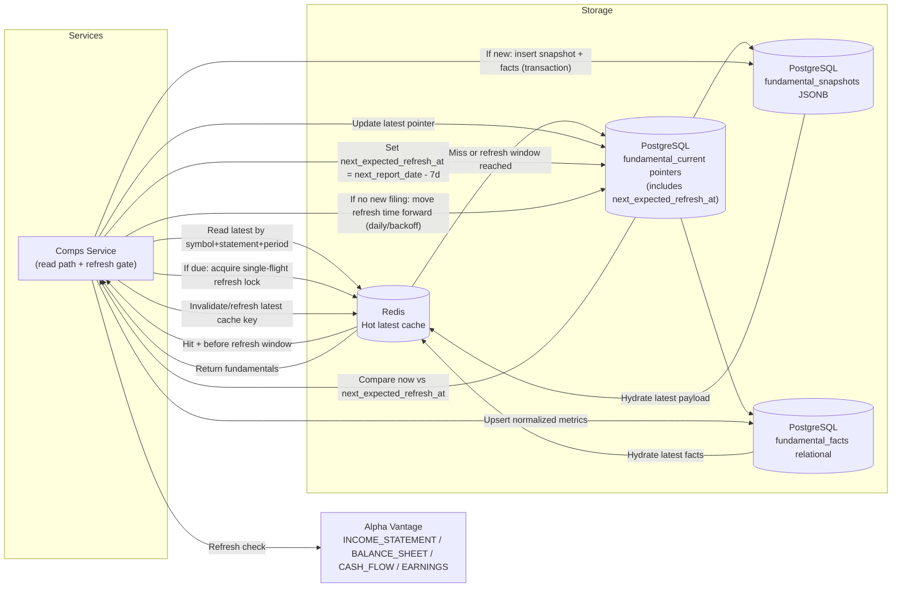

# ADR-002: Fundamental Data Caching Strategy (Cache-Until-Next-Filing)

## Context & Background

TalkToYourStock needs deterministic fundamentals for comps while minimizing Alpha Vantage calls.

What must be true:
* Fundamentals should be fast to read during run execution.
* Data should remain stable/auditable for historical runs.
* Freshness should follow filing cadence (annual/quarterly), not short quote-style TTLs.
* Storage design should support both raw payload retention and efficient metric queries.

## Decision

### Architecture / Flow

Notes:

* Annual data is treated as 10-K-like; quarterly data is treated as 10-Q-like.
* Cache is updated when a newer filing version is detected, not by short-lived TTL churn.
* `next_expected_refresh_at` is scheduled one week before the next expected report date.
* Once the refresh window starts, checks are controlled (e.g., daily with single-flight locking).

### Storage & Data Format

* **Primary durable store:** PostgreSQL
* **Hot cache:** Redis
* **Raw storage format:** JSONB in `fundamental_snapshots`
* **Query-optimized format:** relational rows in `fundamental_facts`
* **Latest lookup model:** `fundamental_current` pointer table per symbol/statement/period

Example uniqueness key for immutable snapshot versions:
* `(symbol, statement_type, period_type, fiscal_date_ending, reported_date, source_hash)`

### Refresh Timing Policy

* Compute `next_expected_refresh_at` from calendar/report timing data:
  * `next_expected_refresh_at = next_report_date - 7 days`
* Before this timestamp: serve cached latest data.
* At/after this timestamp: allow refresh checks (single-flight), typically daily.
* If new filing not available yet: push `next_expected_refresh_at` forward using controlled backoff.

### Decision Summary

> We decided to use a hybrid storage model: **Redis for hot latest reads** and **PostgreSQL (JSONB snapshots + normalized relational facts)** for durable, auditable, and query-efficient fundamentals, with a **cache-until-next-filing** invalidation strategy.

### Rationale

* Decision drivers: low latency, deterministic calculations, auditability, provider rate-limit control.
* Key assumptions:
  * Fundamentals change on filing cadence, not continuously like quotes.
  * Comps calculations need normalized fields for fast deterministic queries.
  * Raw payload preservation is required for traceability and future reprocessing.
  * Refresh checks should begin early enough to catch schedule pull-ins (7-day lead).
* Non-goals:
  * Storing only opaque blobs with no normalized query layer.
  * Pure Redis-only storage for authoritative financial data.
  * Eventual migration complexity for additional providers in this ADR.

---

## Consequences

### Positive

* Fast read path for run execution via Redis.
* Durable and reproducible history via immutable JSONB snapshots.
* Efficient computation path via normalized relational facts and indexes.
* Clear freshness semantics aligned to filing events.

### Negative / Trade-offs

* More complexity than single-table storage.
* Requires synchronization between snapshot and fact layers.
* Requires refresh orchestration to detect and apply new filing versions.

## Considered Alternatives

* **Redis-only cache with no durable snapshot layer**
  Rejected because it cannot provide strong auditability or reproducibility.

* **PostgreSQL JSONB only (no normalized facts)**
  Rejected because deterministic comps queries become slower and harder to index at scale.

* **No cache, call Alpha Vantage per run**
  Rejected because latency and rate-limit risk are too high for interactive chat workflows.
