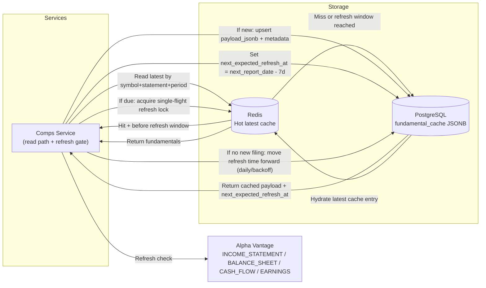

# ADR-002: Fundamental Data Caching Strategy (Cache-Until-Next-Filing)

## Context & Background

TalkToYourStock needs deterministic fundamentals for comps while minimizing Alpha Vantage calls.

What must be true:
* Fundamentals should be fast to read during run execution.
* Data should remain stable/auditable for historical runs.
* Freshness should follow filing cadence (annual/quarterly), not short quote-style TTLs.
* Storage design should stay simple while preserving the clean Alpha Vantage payload.

## Decision

### Architecture / Flow

Notes:

* Annual data is treated as 10-K-like; quarterly data is treated as 10-Q-like.
* Cache is updated when a newer filing version is detected, not by short-lived TTL churn.
* `next_expected_refresh_at` is scheduled one week before the next expected report date.
* Once the refresh window starts, checks are controlled (e.g., daily with single-flight locking).

### Storage & Data Format

* **Primary durable store:** PostgreSQL
* **Hot cache:** Redis
* **Single table:** `fundamental_cache`
* **Payload format:** Alpha Vantage response stored as `payload_jsonb`
* **Read model:** Comps Service parses required metrics from the JSON payload at runtime

Core fields:
* `symbol`
* `statement_type` (`income_statement`, `balance_sheet`, `cash_flow`, `earnings`)
* `period_type` (`annual`, `quarterly`)
* `latest_fiscal_date`
* `payload_jsonb`
* `source_hash`
* `fetched_at`
* `next_expected_refresh_at`

Uniqueness key:
* `(symbol, statement_type, period_type)`

### Refresh Timing Policy

* Compute `next_expected_refresh_at` from calendar/report timing data:
  * `next_expected_refresh_at = next_report_date - 7 days`
* Before this timestamp: serve cached latest data.
* At/after this timestamp: allow refresh checks (single-flight), typically daily.
* If new filing not available yet: push `next_expected_refresh_at` forward using controlled backoff.

### Decision Summary

> We decided to use a simple hybrid cache: **Redis for hot latest reads** and **one PostgreSQL `fundamental_cache` table with JSONB payloads** for durable fundamentals, with a **cache-until-next-filing** invalidation strategy.

### Rationale

* Decision drivers: low latency, deterministic calculations, auditability, provider rate-limit control.
* Key assumptions:
  * Fundamentals change on filing cadence, not continuously like quotes.
  * Alpha Vantage fundamentals are already clean enough to store and parse directly as JSON.
  * MVP comps calculations can parse needed fields from JSONB without a separate facts table.
  * Refresh checks should begin early enough to catch schedule pull-ins (7-day lead).
* Non-goals:
  * Designing a fully normalized financial facts warehouse in MVP.
  * Pure Redis-only storage for authoritative financial data.
  * Eventual migration complexity for additional providers in this ADR.

---

## Consequences

### Positive

* Fast read path for run execution via Redis.
* Durable fundamentals in a single PostgreSQL table.
* Simpler MVP implementation with fewer synchronization paths.
* Clear freshness semantics aligned to filing events.

### Negative / Trade-offs

* Runtime parsing from JSON is less query-efficient than pre-normalized facts.
* Historical filing versions are not fully modeled in this initial table shape.
* A normalized facts table may be introduced later if calculation/query needs grow.

## Considered Alternatives

* **Redis-only cache with no durable snapshot layer**
  Rejected because it cannot provide strong auditability or reproducibility.

* **Separate snapshot + facts + current tables**
  Rejected because Alpha Vantage payloads are clean enough for MVP and the extra tables add unnecessary synchronization complexity.

* **No cache, call Alpha Vantage per run**
  Rejected because latency and rate-limit risk are too high for interactive chat workflows.
