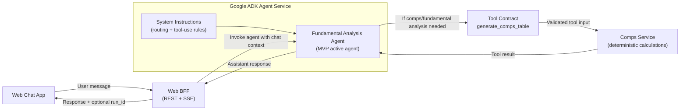

# ADR-003: Agent Architecture

## Context & Background

TalkToYourStock will use Google ADK for agent orchestration. The MVP agent focus is fundamental analysis with trading comps.

What must be true:
* The user experience remains chat-first.
* The agent can answer conversational finance questions without always creating a run.
* Deterministic comps outputs come from tools/services, not free-form LLM arithmetic.
* The initial design supports one active agent while leaving room for future agent families.
* Agent-internal debugging should rely on Google ADK's native sessions, events, traces, and developer tooling rather than duplicating that observability model in the application database.

## Decision

### Architecture / Flow

Notes:

* Google ADK owns orchestration behavior.
* Google ADK-native observability is the primary surface for agent internals, including tool-call history and model/tool traces.
* This ADR describes agent behavior and tool boundaries.
* The Fundamental Analysis Agent may explain results, but it does not invent or recalculate final comps metrics.

### Agent Observability

The application database stores product state: Threads, Messages, Runs, Comps Tables, Traces, Source Snapshots, and links between Messages and Runs. It does not duplicate full ADK agent event history in MVP.

Agent-internal observability should build around ADK-native capabilities such as sessions, event history, traces, logs, and the local ADK web/debug interface. If production needs later require additional retention, privacy controls, or cross-system correlation, that should be added as a specific observability decision rather than by defaulting to a custom agent trace store.

### MVP Agent Scope

* Active agent: **Fundamental Analysis Agent**
* Core responsibility: handle comps-backed prompts and trigger deterministic comps analysis when appropriate.
* Production tool: `generate_comps_table`
* Future agents, out of MVP design:
  * News/Media Sentiment Agent
  * Technical Analysis Agent

### Intent Handling

Intent handling is primarily expressed through the agent system instructions, but the result must be treated as a product decision, not just prose.

The agent decides whether a message is:
* **Conversational**: answer directly, no run created.
* **Fundamental/comps analysis**: call `generate_comps_table`, create a run, and return table-backed analysis.
* **Ambiguous**: ask a short clarifying question before tool execution.

If the Comps Service rejects a tool call before creating a Run because the structured input is invalid, the Agent may perform one internal correction retry. If the corrected tool call is still invalid, the Agent surfaces a concise clarification or error to the User instead of looping.

### Ticker Handling

Ticker extraction means the Agent converts user language into structured tool input with canonical ticker symbols before tool execution. The Comps Service validates the supplied tickers through the tool boundary and returns clear validation errors when a ticker is unsupported or incorrect, so the Agent can ask for clarification or retry with corrected structured input.

Examples:
* `"Tesla"` -> `TSLA`
* `"Google"` -> Agent supplies its best structured ticker candidate or asks for clarification if share class matters
* `"compare Apple to Microsoft and Nvidia"` -> target/peer candidates: `AAPL`, `MSFT`, `NVDA`

Validation means confirming the ticker exists and is supported before creating or completing a comps Run. Implementation details belong outside this ADR.

### Tool Contract

`generate_comps_table` is the only MVP production tool.

Initial conceptual input:
* `target_ticker`
* `peer_tickers` (required when peers are user-supplied)
* `peer_selection_mode` (`user_supplied` or `auto`)
* `analysis_period` (`latest` for MVP)

Initial conceptual output:
* `run_id`
* `table`
* `trace`
* `warnings`

When auto peer selection is supported, it remains a Comps Service responsibility: if the User provides only one company, the Comps Service selects comparable peers deterministically and exposes traceable selection reasoning.

### Decision Summary

> We decided to use **Google ADK for agent orchestration and agent-internal observability** with one active MVP agent, the **Fundamental Analysis Agent**, which can answer conversational questions directly or call one deterministic tool, `generate_comps_table`, for table-backed comps analysis.

### Rationale

* Decision drivers: chat UX, deterministic financial output, tool isolation, ADK-native observability, future agent extensibility.
* Key assumptions:
  * MVP product value is fundamental analysis and trading comps.
  * Agent instructions are sufficient for initial routing, with tool inputs still validated by services.
  * The old prototype did not implement deterministic comps.
* Non-goals:
  * Multi-agent routing across news/sentiment and technical analysis in MVP.
  * Letting the LLM calculate final financial metrics without tool-backed data.

---

## Consequences

### Positive

* Keeps agent behavior product-focused and understandable.
* Separates conversational reasoning from deterministic financial computation.
* Allows future agents without changing the initial comps workflow.
* Gives a clean place to enforce tool-use rules and refusal/clarification behavior.
* Avoids duplicating ADK's session/event/trace model in application persistence.

### Negative / Trade-offs

* System prompt quality matters for routing until more structured classifiers are added.
* Auto peer selection remains a product/design problem inside the Comps Service.
* Tool contract may evolve once the exact data fields needed for comps are validated.
* Agent debugging depends on ADK observability surfaces being available and understood in local and production-like environments.

## Considered Alternatives

* **Single prompt-only agent with no tool boundary**
  Rejected because financial tables and valuation metrics need deterministic, auditable computation.

* **Three-agent system in MVP**
  Rejected because news/sentiment and technical analysis are future scope and would broaden the initial build too much.

* **Agent directly owning calculations**
  Rejected because financial calculations need deterministic tool-backed outputs, not free-form agent reasoning.

* **Custom application-level agent trace store in MVP**
  Rejected because Google ADK is intentionally part of the architecture for agent orchestration and observability. MVP application persistence should store product state and run audit artifacts, while ADK-native sessions/events/traces handle agent internals.
